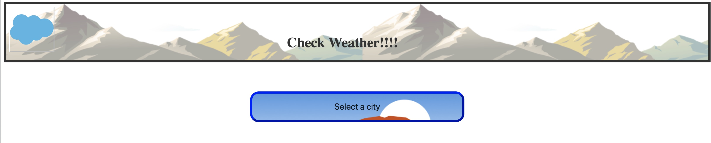
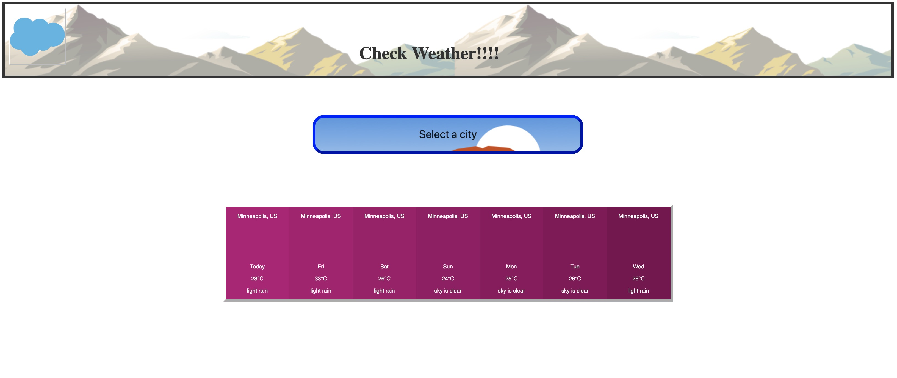

# Weather Dashboard

This project was developed with ReactJS and `@salesforce/lightning-design-system`. As this application is using webpack, using css would require more time. I was able to create my stylesheet but that could not be used yet in this application. That would be a todo for future.

While I would have loved to spend a significant amount of time properly injecting asset dependencies from the lightning design system into the build pipeline (webpack), I chose to copy them directly out of the package into a assest folder. This application is susceptible to code rot when the lightning design system is updated, therefore it should not be used as an example for using the lightning design system. It was inteded for prototype and demonstration purpose only - that I am capable of writing clean enough code and am comfortable learning a new technology.

Future Todo: Adding icons and be able to display data for everyday in one card view.
# Output
These are the screens and how they are visible.

Select City.

Weather being displayed.

## Introduction

Using this app user would be able to see weather information of 4 cities. 

During this project http://api.openweathermap.org/data/2.5/forecast/daily?q=${city}&units=metric&cnt=7&appid=${openWeatherApiKey}` api was used to get data in json format and every every day data was processed and displayed according. 

## Challenges
During this project, i faced most challenges in setting up @salesforce/lightning-design-system with my existing React boiler plate. 
Finding the right version number of libraries.
Dropdown event is not getting triggered and i have identified that as a future version.

## Features

This application features all the latest tools and practices in the industry.

- ⚛ **React** — 16.7.0-alpha.0 with Hooks
- ♻ **Redux with Redux Thunk** — State Management with middleware to handle async requests
- 🛠 **Babel** — ES6 syntax, Airbnb & React/Recommended config
- 🚀 **Webpack**  — Hot Reloading, Code Splitting, Optimized Build
- 💅 **CSS** — Styled Components
- ✅  **Tests** — Jest, React Testing Library & Cypress
- 💖  **Lint** — ESlint
- 🐶  **Husky** — Prevent bad commits

## Getting started

1. Clone this repo using git clone git@github.com:puneetp0110/weatherApp.git
2. Move to the appropriate directory: `cd weatherApp`. 
3. Run `yarn` or `npm install` to install dependencies. 
4. Run `npm start` to see the example app at `http://localhost:8080`.

## Commands

- `npm start` - start the dev server
- `npm run build` - create a production ready build in `dist` folder
- `npm run lint` - execute an eslint check
- `npm run lint:fix` - execute an eslint and fix the errors
- `npm test` - run all tests
- `npm run test:watch` - run all tests in watch mode
- `npm run test:cover` - coverage mode
- `npm run cypress:open` - starts cypress

## Available Scripts

In the project directory, you can run:

### `npm start`

Runs the app in the development mode. 
Open [http://localhost:3000](http://localhost:3000) to view it in the browser.

The page will reload if you make edits. 
You will also see any lint errors in the console.

### `npm run build`

Builds the app for production to the `build` folder. 
It correctly bundles React in production mode and optimizes the build for the best performance.

The build is minified and the filenames include the hashes. 
Your app is ready to be deployed!

See the section about [deployment](https://facebook.github.io/create-react-app/docs/deployment) for more information.

### Deployment

https://facebook.github.io/create-react-app/docs/deployment
## Next features:

- [ ] **Hot Module Replacement**: Better HMR support;
- [ ] **CSS/Sass support**: Enable CSS/Sass support;
- [ ] **PWA**: Turn into a PWA boilerplate;
- [ ] **SEO**: SEO-ready;
